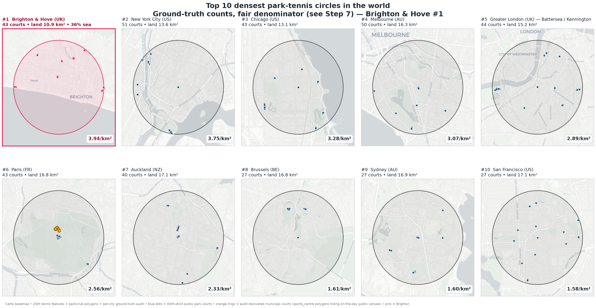

# Is Central Brighton & Hove the densest park-tennis cluster in the world?

A data-driven, audited analysis ranking 16 major world cities by the
density of public, on-the-day-bookable park tennis courts inside a
2.34 km circle.

**Headline finding: yes.** Brighton & Hove holds the densest cluster of
public, accessible park-tennis courts of any major city audited —
**3.94 courts per km² of land**, ahead of New York (3.75, the nearest
challenger), Chicago, Melbourne, Greater London, Paris, Auckland,
Brussels, Sydney, San Francisco and every other audited city. Brighton
is the only city in the global top eight with a population under one
million.

📄 **[Read the full writeup (HTML)](./index.html)**  •  **[Download PDF](./densest_circle_full_writeup.pdf)**



## What this analysis does

For each of 16 candidate cities (Boston, Paris, NYC, Chicago,
Auckland, Los Angeles, Toronto, Sydney, Melbourne, Rome, Buenos
Aires, San Francisco, Tokyo, Brussels, Greater London, Brighton &
Hove), it finds the densest 2.34 km circle of "public park tennis
courts" — defined as a court that's bookable on the day by a member
of the public, or free to enter, on land tagged as a public park in
OpenStreetMap. The pipeline:

1. Pulls OSM `leisure=pitch + sport=tennis` features for every city
2. Spatial-joins with `leisure=park` polygons and excludes courts
   inside `leisure=sports_centre` or `club=tennis` polygons
3. Sea-corrects + water-corrects every city's denominator
4. Finds the densest 2.34 km sub-circle in each city
5. **Ground-truth audits every top-16 city** against the local
   parks-and-recreation authority (15 independent research agents)
6. Applies a fair-denominator rule that subtracts only water (not
   neighbouring municipalities' land) — the same correction that's
   been flagged for Boston since Step 4

…and Brighton lands at rank 1 in the world.

## Repo layout

```
scripts/         Python pipeline (one script per step, numbered 01–28)
data/processed/  Final CSVs — ground_truth.csv is the canonical Step 6/7
                 table (audited counts + fair denominators), read by the
                 rendering scripts
data/raw/        OSM Overpass cache (gitignored — regenerated by make uk-osm)
reports/         Rendered PNGs, the markdown writeup, per-city audit reports
  └── ground_truth/   15 per-city audit reports
index.html       The full writeup, HTML version (auto-served by GitHub Pages)
*.pdf            Downloadable PDF version
```

## Reproducing the analysis

```bash
python3 -m venv .venv
source .venv/bin/activate
pip install -r requirements.txt

# Full pipeline (re-fetches OSM data — ~15-20 min, respects rate limits)
make uk                  # UK statistics phase
python scripts/13_fetch_parks.py
python scripts/16_global_densest.py
python scripts/19_land_area.py
python scripts/21_sea_corrected_density.py
python scripts/24_park_filter_v2.py --region uk
python scripts/25_densest_final.py
python scripts/28_fetch_water.py
python scripts/22_densest_report_v2.py
python scripts/26_top10_circle_maps.py

# Just the render (uses existing cached data)
make report              # → reports/_densest_circle_full_writeup.html and .pdf
make deploy              # also copies HTML/PDF to repo root for GitHub Pages
```

Note on reproducibility: the pipeline scripts regenerate everything
through Step 4/5 (OSM-strict counts, sea correction, club exclusion)
from a fresh Overpass fetch. The Step 6/7 numbers — audited counts and
fair denominators — come from the manual per-city audits and live in
`data/processed/ground_truth.csv`; the chart/map renderers read that
file. The NYC river polygons and Chicago's Lake Michigan polygon were
synthesised/fetched outside the numbered pipeline (see the writeup's
Methodology notes) and their water areas are recorded in the same CSV.

## Methodology + caveats

Walk through Steps 0 → 7 in [the writeup](./index.html). Three things
worth knowing:

- **The audit isn't bulletproof.** Brighton's audit is high
  confidence (BHPLTA-verified, venue-by-venue). The other 15 city
  audits are single-agent one-shot web research at medium / medium-low
  confidence. Per-city audit reports are in `reports/ground_truth/`.
- **Two cities required synthesised water polygons** because OSM
  uses `natural=coastline` (lines) rather than `natural=water`
  polygons for some major tidal/lake water bodies — New York's
  Harlem River + East River (centerline-buffered) and Chicago's
  Lake Michigan (relation 1205149, fetched and stitched).
- **Tokyo is asterisked** in the ranking because the global pipeline
  uses a bbox scope for Tokyo (no clean OSM 23-wards relation at
  the time of the fetch); that bbox catches Saitama-prefecture
  courts in three separate municipalities. On a Tokyo-23-wards-only
  recount (~25-30 courts), Tokyo's density is roughly 3.0-3.6 on the
  Tokyo-side land (admin-clip basis) or ~1.5-1.8 on the fair
  whole-disc denominator the final ranking uses — below Brighton on
  either reading.

## Sources

- **Tennis courts**: OpenStreetMap via Overpass API (cached snapshot
  from May 2026 in `data/raw/`).
- **Park polygons, club polygons, water polygons, admin boundaries**:
  OSM, same fetch.
- **Population estimates**: ONS / NRS / NISRA (UK), Wikidata (global).
- **Ground-truth audit sources**: City parks-and-recreation
  authorities (NYC Parks, Tennis Paris, Chicago Park District,
  Auckland Council, LA Recreation & Parks, etc.) — full source list
  per city in `reports/ground_truth/*.md`.

## Acknowledgements

OpenStreetMap contributors, Brighton & Hove Parks Lawn Tennis
Association, Will To Win, Lambeth Parks Tennis. Analysis pipeline by
[jim.tennis](https://github.com/jameshartt) — May 2026.

## License

Code: MIT. Data: see OSM ODbL terms. Report text: CC-BY-4.0.
