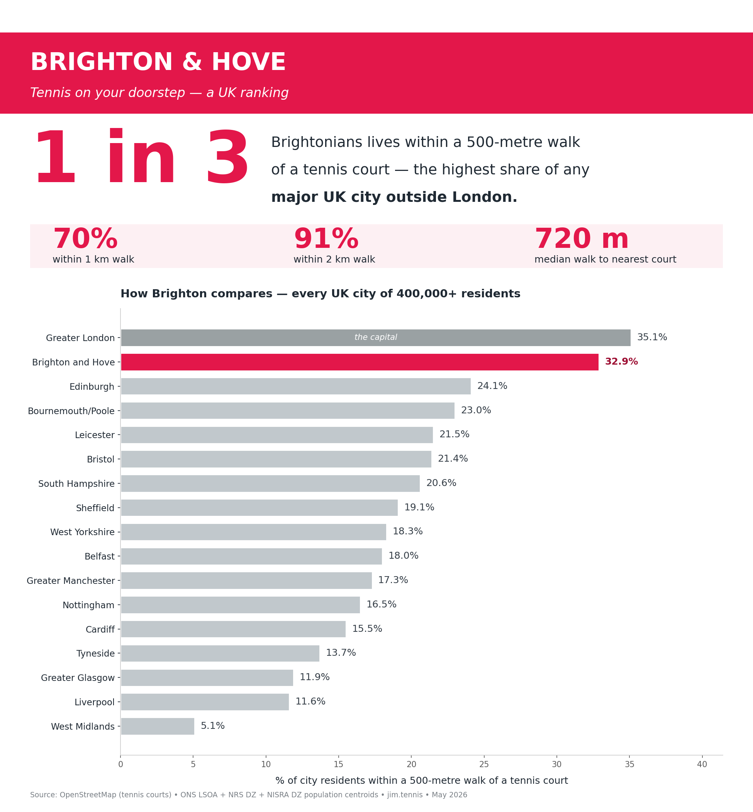
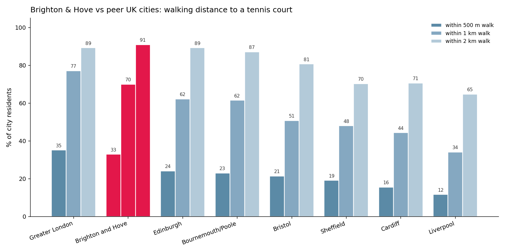
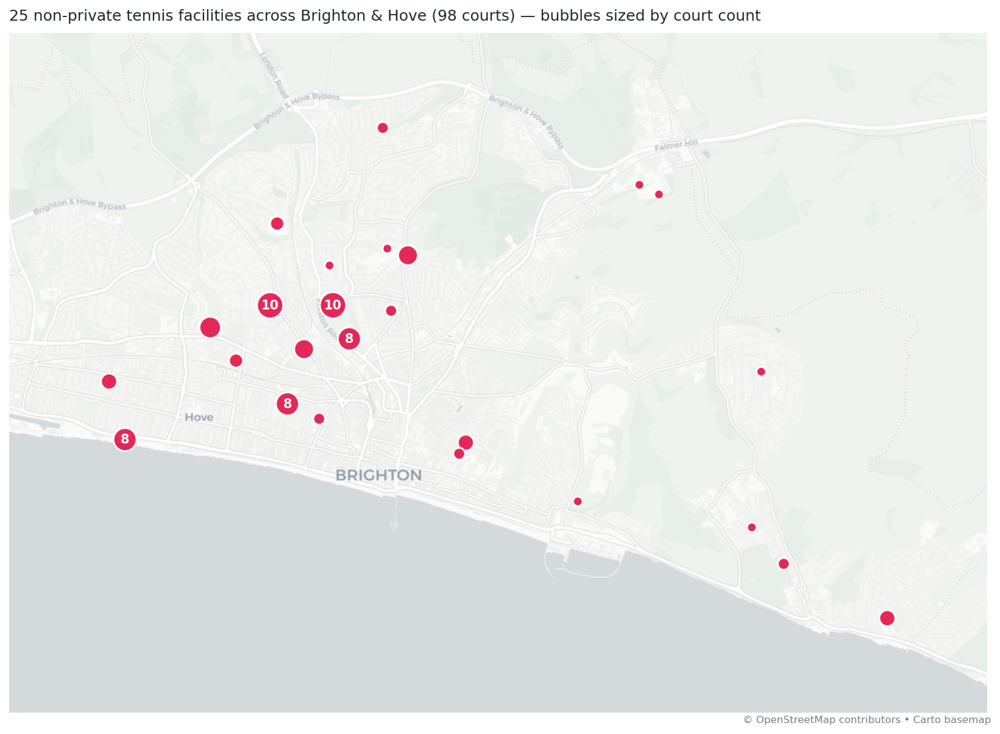
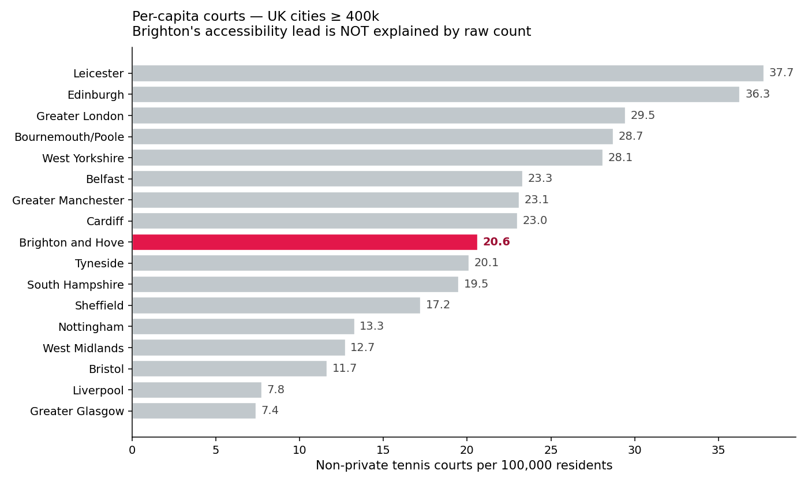

# Brighton & Hove: the most walkable major UK city for tennis (outside London)
*Prepared for the Brighton & Hove Parks Lawn Tennis Association — May 2026*

---
## The headline
**Roughly one in three Brightonians lives within a 500-metre walk of a tennis court — 32.9% of residents — the highest share of any major UK city outside Greater London.**

Among UK cities of 400,000 residents or more, only the capital is more walkable than Brighton — and even then by just a couple of percentage points. Edinburgh, our nearest major-city peer (482k residents), reaches 24.1%; Bournemouth/Poole, our nearest peer in shape, sits at 23.0%.

Nine in ten residents — 90.9% — live within a 2 km walk (about 25 minutes on foot). The typical Brighton resident is just 720 metres from their nearest court — under 10 minutes' walk for most of us.

## How we measured it
For every UK city we used the **population-weighted centroids** of every small statistical area (LSOA in England & Wales, Data Zone in Scotland and Northern Ireland — averaging ~1,500 residents each, the smallest unit each country's statistics office publishes). For each centroid we measured the distance to its nearest **non-private** tennis court (OpenStreetMap data: `leisure=pitch + sport=tennis` and `leisure=sports_centre + sport=tennis`, excluding `access=private`). The resulting % is the share of **residents**, not area, within walking distance — so a few isolated park courts in low-density suburbs don't inflate the score.

## Brighton vs the major UK cities

All UK cities with built-up-area population of 400,000 or more, ranked:

| # | City | BUA pop. | Residents in polygon | Within 500 m | Within 1 km | Within 2 km | Median walk |
| ---: | --- | ---: | ---: | ---: | ---: | ---: | ---: |
| 1 | Greater London | 9,787,426 | 10,249,200 | 35.1% | 77.1% | 89.3% | 625 m |
| **2** | **Brighton and Hove** | **474,485** | **308,606** | **32.9%** | **70.0%** | **90.9%** | **720 m** |
| 3 | Edinburgh | 482,270 | 513,942 | 24.1% | 62.2% | 89.3% | 836 m |
| 4 | Bournemouth/Poole | 466,266 | 454,017 | 23.0% | 61.5% | 87.1% | 770 m |
| 5 | Leicester | 508,916 | 753,279 | 21.5% | 55.4% | 93.1% | 904 m |
| 6 | Bristol | 617,280 | 573,418 | 21.4% | 50.8% | 80.7% | 966 m |
| 7 | South Hampshire | 855,569 | 1,035,995 | 20.6% | 54.5% | 77.7% | 921 m |
| 8 | Sheffield | 685,368 | 753,880 | 19.1% | 48.0% | 70.3% | 1047 m |
| 9 | West Yorkshire | 1,777,934 | 2,667,179 | 18.3% | 49.2% | 79.5% | 1012 m |
| 10 | Belfast | 595,879 | 526,081 | 18.0% | 47.6% | 82.9% | 1039 m |
| 11 | Greater Manchester | 2,553,379 | 3,400,007 | 17.3% | 46.7% | 76.2% | 1072 m |
| 12 | Nottingham | 729,977 | 524,361 | 16.5% | 46.2% | 81.0% | 1063 m |
| 13 | Cardiff | 447,287 | 478,142 | 15.5% | 44.3% | 70.6% | 1097 m |
| 14 | Tyneside | 774,891 | 1,122,647 | 13.7% | 39.0% | 71.0% | 1272 m |
| 15 | Greater Glasgow | 957,620 | 742,204 | 11.9% | 32.7% | 57.3% | 1663 m |
| 16 | Liverpool | 864,122 | 709,963 | 11.6% | 34.1% | 64.7% | 1397 m |
| 17 | West Midlands | 2,440,986 | 2,822,651 | 5.1% | 11.5% | 20.6% | 5261 m |

London edges Brighton on the headline metric (35.1% vs 32.9%) — the capital has both the densest population and the most mapped tennis infrastructure of anywhere in the UK. **Outside London, no city comes close.** Edinburgh trails by 8.8 percentage points; Liverpool, Cardiff and Sheffield manage roughly half of Brighton's score.

## A side-by-side with peer cities

## What's actually here
OpenStreetMap currently has **98 non-private courts** across **25 distinct facilities** within Brighton & Hove (plus 22 private courts excluded from these figures). A typical facility carries about four courts — Brighton's pattern is well-resourced multi-court parks rather than scattered single courts.

## Why Brighton wins (outside the capital)
Three things compound:

1. **Compact urban form.** The city's populated area is tightly bounded by the sea to the south and the South Downs to the north — so there is very little low-density sprawl for residents to be stranded in.
2. **Multi-court parks distributed across that compact form.** Pavilion & Avenue, Withdean, Saltdean, Hove Recreation Ground, Queen's Park, Preston Park and St Ann's Well together place a non-trivial cluster within most residents' postcodes.
3. **A public-tennis culture, not a private one.** Of 120 total tennis surfaces in the city, only 22 are tagged `access=private`. The rest are park courts, council-managed sites, or pay-and-play clubs — the BHPLTA model in action.

## Per-capita context (the honest sub-headline)
On absolute courts-per-100,000-residents, Brighton sits mid-table at 20.6 — behind university towns like Oxford and Cambridge that pack large numbers of college courts into small populations, and behind Leicester / Edinburgh among major cities. **Accessibility, not raw count, is where Brighton excels** — and in a city this size, accessibility is what determines whether the average resident can actually play.

## Caveats (so we can defend the claim)
- **OpenStreetMap completeness.** OSM is community-mapped; if a court isn't tagged we can't count it. Brighton appears well-mapped on a manual spot-check (98 courts at 25 facilities is consistent with the city's BHPLTA member sites plus the council park courts).
- **Geographic scope.** Full UK — England + Wales LSOAs (ONS), Scotland Data Zones (NRS), Northern Ireland Data Zones (NISRA). 75 of 76 cities above 100k are ranked.
- **Population data.** Latest published mid-year LSOA estimates for England + Wales (2011 boundaries), 2011 census Data Zone counts for Scotland, 2021 census Data Zone counts for Northern Ireland.
- **Polygon containment.** Each city's residents are those whose small-area centroid sits inside the city's administrative bounding box. The 308,606 residents counted for Brighton & Hove are those inside the Brighton & Hove unitary authority polygon (matching what residents call 'Brighton & Hove' day-to-day). Worthing and Lancing — bundled into the larger 'Brighton' BUA in 2011 census geography — aren't counted on either side.
