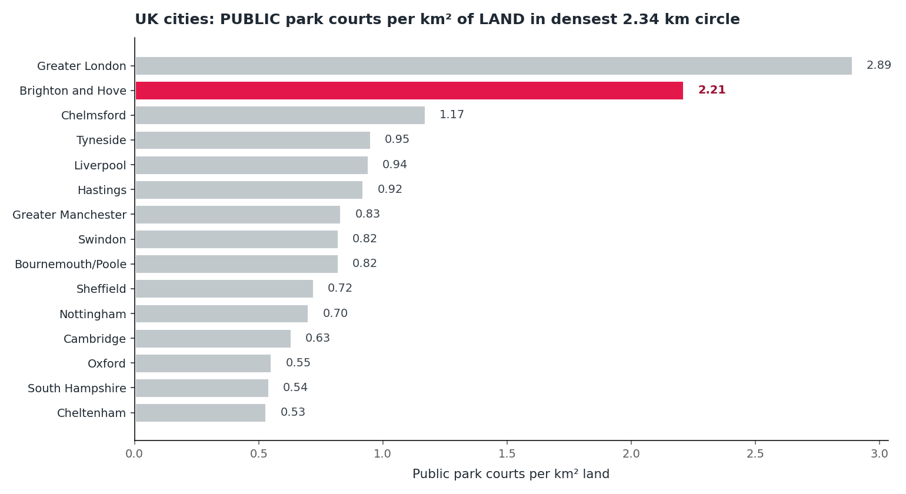

# Brighton & Hove: densest tennis cluster in the world?
*Park-courts density per square kilometre of LAND in a 2.34 km circle just enclosing Queens Park, Pavilion & Avenue, Blakers Park and Kingsway / Hove Beach Club.*

---

## Brighton's 'Central B&H' circle

- Centre: 50.8257°N, 0.1565°W
- Radius: 2337 m
- Disc area: 17.15 km²
- **Land area: 10.90 km² (36.4% of the disc is sea)**
- Park courts within the circle: **37**
- Park-court density: **3.39 park courts per km² of land**

## UK ranking (sea-corrected)

Park courts per km² of LAND in each city's densest 2.34 km circle:

## World ranking (sea-corrected)

Same metric across major global cities. Brighton & Hove highlighted. Cities flagged 'bbox' lack a clean OSM admin polygon so their numbers are NOT sea-corrected and are therefore upper bounds.

## Caveats

- **Park-courts only.** Courts that sit inside a `leisure=park`, `recreation_ground`, `garden` or `common` polygon. Excludes private clubs, college courts, and clubs that aren't in a park.
- **Sea correction.** Land area computed by intersecting the densest 2.34 km circle with the city's OSM admin-boundary polygon. For cities defined by bbox (Tokyo 23 wards, Melbourne, Sydney, Auckland) no boundary polygon exists, so those numbers are not corrected and overstate density.
- **'Park courts' can still include private clubs that sit physically inside a public park polygon.** Notably Paris's headline cluster is in the Bois de Boulogne, which contains Roland Garros and the major French members' clubs. A future iteration excludes courts inside `leisure=sports_centre` / `club=tennis` polygons.
