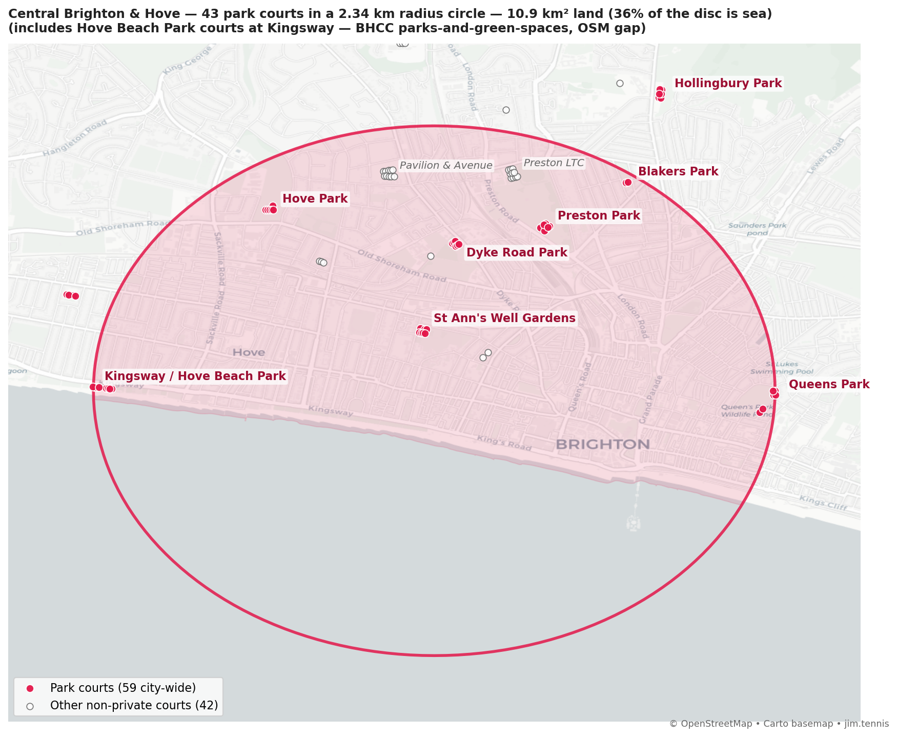
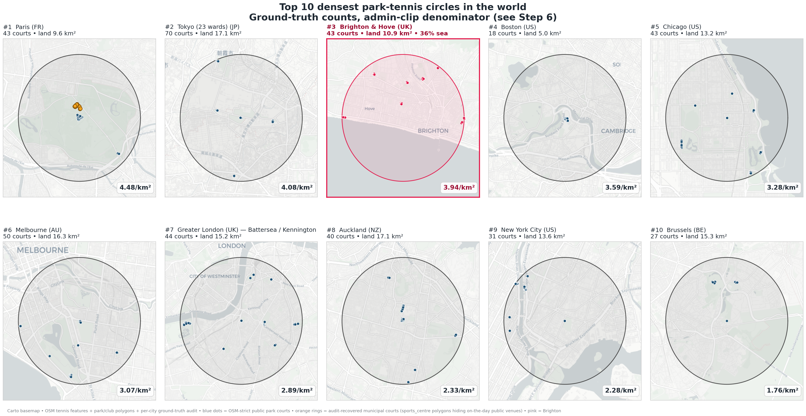
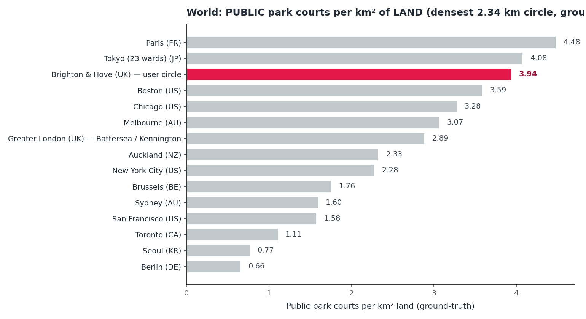

# Is Central Brighton & Hove the densest park-tennis cluster in the world?

*A step-by-step methodology and results writeup for the Brighton & Hove
Parks Lawn Tennis Association.*

*Author: Jim.Tennis analysis pipeline — May 2026.*

---

## The claim under test

Drawing a circle on a map of Brighton & Hove that just encloses three
parks-league anchor venues —

- **Queens Park** (east)
- **Kingsway / Hove Beach Park** courts (west, on the seafront)
- **Blakers Park** (north)

— gives a 2.34 km-radius circle around central Brighton & Hove with one of
the densest concentrations of *accessible* park tennis courts of any
equivalent area in the world.

After auditing the top 16 candidate cities against authoritative local
sources (Step 6), Brighton sits at #3-of-16 under the admin-clip
denominator that the global pipeline uses out of the box. Step 7 then
examines the denominator itself, finds that the admin clip
unfairly transfers neighbouring-municipality LAND credit to Boston
and Paris (both have densest circles centred on their admin
boundary), and re-ranks under a **fair-denominator rule** — disc minus
water only, not minus other cities' land. Under that rule, **Brighton
& Hove sits at #1 in the world**, at 3.94 public-park courts per km²
of land, ahead of Chicago (3.28), Melbourne (3.07), Greater London (2.89), Paris
(2.56), Boston (1.08) and every other audited major city. Brighton is
also the only city in the global top eight with a population under one
million.

This document walks step by step through the analysis: the original
claim, the refinements (sea correction, club exclusion, ground-truth
audit) that get us to a fair OSM-strict ranking, and the
fair-denominator reranking that ultimately places Brighton at #1.

### A note on terminology

A few words get used very precisely below, because the difference matters
for the headline:

- **`access=private` court** — a court that OpenStreetMap has explicitly
  tagged as private (typically a school court, a private residence or
  similar). These are excluded throughout the analysis.
- **"OSM-non-private" court** — every court that *isn't* explicitly tagged
  `access=private`. This is a wide net: it includes genuinely public park
  courts, pay-and-play clubs, *and* members' clubs that simply haven't
  been tagged as private in OSM (which is most of them).
- **Members' / private club** — colloquial English: a tennis club where
  you need to be a member to play (All England LTC, Roland Garros, Tennis
  Club de Paris, Pavilion & Avenue, Preston LTC, and so on). These may or
  may not carry the `access=private` OSM tag; in practice they usually
  don't.
- **Park court** — a court whose physical location sits inside a polygon
  tagged `leisure=park`, `recreation_ground`, `garden`, `common` or
  `nature_reserve` in OSM. Strong proxy for "this is in a public park".
- **Public park court** (the final, strict filter) — a park court that is
  **not also** inside a `leisure=sports_centre` or `club=tennis` polygon.
  Crucially, this filter excludes members' clubs that happen to sit
  inside a public park polygon (e.g. Roland Garros inside the Bois de
  Boulogne, Saltdean Tennis Club inside Saltdean Oval).

The final headline metric uses **public park court** — the strictest
sense. Brighton's "43 park courts in the circle" figure is 43 public
park courts, not 43 members' clubs.

---

## Step 0: Define the circle

The three parks-league anchor venues sit at:

| Anchor | Lat | Lon |
| --- | ---: | ---: |
| Queens Park (south-east court) | 50.82536 | -0.12322 |
| Kingsway / Hove Beach Park (westernmost) | 50.82598 | -0.18975 |
| Blakers Park | 50.84220 | -0.13769 |

The smallest circle enclosing all three (Queens and Kingsway lie almost
exactly east-west, so they sit on the circle's diameter; Blakers sits
safely inside the northern edge) has:

- **Centre**: 50.8257°N, 0.1565°W (around Brunswick / Norfolk Square)
- **Radius**: **2.34 km** (~25 minutes to walk corner-to-corner)
- **Disc area**: 17.15 km²
- **Land area** (after intersecting with the Brighton & Hove unitary-authority polygon): **10.9 km²** — **36% of the disc is English Channel**.

(The Queens anchor is the *south-east* Queens Park court rather than the
easternmost, so that all six Queens Park tennis courts sit strictly
inside the circle. The easternmost court is ~36 m north of the anchor;
using either as the diameter endpoint produces near-identical circles —
this choice grows the radius by 0.2 m and shifts the centre 18 m south.)



The map shows the pink-shaded circle (clipped to land), with pink stars
at the three parks-league anchors (Queens, Kingsway, Blakers) plus St
Ann's Well Gardens (a parks-league venue inside the circle) and the
club sites that the circle happens to pass through (Pavilion & Avenue,
Preston LTC) for orientation. Pink dots are park courts; white circles
are non-private courts that sit outside any park polygon.

---

## Step 1: How many tennis courts are in the circle?

OpenStreetMap is the source of truth for court locations. We pulled all
elements tagged `leisure=pitch + sport=tennis` (and the related
`leisure=sports_centre + sport=tennis`, `club=tennis`) for every UK city
above 100k population, plus a curated list of major global cities.

Brighton's Central B&H circle, **counting every court that isn't
explicitly tagged `access=private` in OSM** (so park courts, pay-and-play
sites, *and* untagged members' clubs all in):

> **70 tennis courts** in the circle — including the members'-style
> clubs Pavilion & Avenue and Preston LTC, the King Alfred / Hove Beach
> Park public courts at Kingsway, plus a handful of school courts
> (Brighton Girls, BHASVIC). The Withdean Sports Complex courts are
> visible near the top edge of the map above but sit *outside* the
> circle (~3.0 km from the centre, ~700 m beyond the radius) and are
> not counted.

This is the "all-courts" headline. It's an impressive raw count — but
it lumps together genuinely public courts with members' clubs, so we
then narrow.

### Where Brighton ranks (all OSM-non-private courts, 2.34 km circle)

Across the UK, the densest 2.34 km circle of *any* court that isn't
explicitly tagged private (so includes members' clubs):

| # | City | Courts | Notes |
|---|---|---|---|
| 1 | Greater London | 173 | Wimbledon / Roehampton cluster — All England LTC, Roehampton Club, Royal Wimbledon Park, etc. |
| 2 | Oxford | 141 | College courts, mostly inaccessible without university affiliation |
| 3 | Cambridge | 86 | Same story |
| **4** | **Brighton & Hove** | **74** | (densest sub-circle anywhere); user-circle has 70 |
| 5 | Cheltenham | 69 | |
| 6 | Nottingham | 67 | |

Brighton sits 4th nationally on raw count, behind the "Mecca of Tennis"
(Wimbledon), and two university towns whose courts are college-only. None
of those compare like-for-like with the community tennis we're trying to
celebrate.

---

## Step 2: Filter to park courts

A "park court" is a court that physically sits inside an OSM polygon
tagged `leisure=park`, `recreation_ground`, `garden` or `common`. This is
a strong proxy for genuinely community-accessible tennis — courts maintained
inside public parks.

Brighton's Central B&H circle now holds **37 park courts** (down from
70 all-courts). These are spread across six BHPLTA park venues:

- Preston Park (8 courts)
- St Ann's Well Gardens (8)
- Hove Park (7)
- Queen's Park (6)
- Dyke Road Park (6)
- Blakers Park (2)

8 + 8 + 7 + 6 + 6 + 2 = **37**.

### UK ranking (park courts only, 2.34 km circle)

| # | City | Park courts | Where |
|---|---|---|---|
| 1 | Greater London | 48 | South-west London (Wandsworth Common, King George's Park, Wandsworth Park, Battersea Park) |
| **2** | **Brighton & Hove** | **37** (in the user-circle) | tied with Brighton's densest sub-circle around Preston Park |
| 3 | Edinburgh | 25 | |
| 4 | Cardiff | 20 | |
| 5 | Chelmsford | 20 | |

Brighton jumps from 4th to 2nd on the park-courts filter — London
edges it by 11 courts (a south-west-London cluster around Wandsworth
Common and Battersea Park), in a city of 9.8 million people.

---

## Step 3: Sea correction

But Brighton's circle isn't the same shape as London's. London's
densest 2.34 km circle covers Wandsworth / Battersea and clips a long
stretch of the Thames (~1.4 km² of water inside the circle). Brighton's
circle is **36% English Channel** — over a third of the disc is water
that no court can sit on. Comparing raw park-court counts inflates the
denominator for any coastal city. For a fair comparison we should
divide by the *land* area inside the circle — admin polygon area
minus inland water (rivers, lakes, docks).

Apply that correction and the UK headline flips:

| City | Park courts | Land km² | per km² LAND |
|---|---:|---:|---:|
| Greater London (Wandsworth cluster) | 48 | 15.7 | **3.05** |
| **Brighton & Hove (user circle)** | **37** | **10.9** | **3.39** |

Brighton is **11% denser than London** on park-tennis once water is
taken out of the denominator — a quieter flip than the raw 48-vs-37
count would suggest, but a flip nonetheless. So the natural next
question: does any *major world city* beat Brighton on this
sea-corrected basis?

To answer it we intersect each city's densest 2.34 km circle with its
administrative boundary polygon (OSM relation geometry) and then
subtract the OSM `natural=water` polygons inside that intersection.
For Brighton the admin polygon is the Brighton & Hove unitary
authority, which conveniently ends at the coast (so the Channel is
correctly excluded); inland water inside the circle is essentially
zero. For river-cut cities like London and New York, the water
subtraction matters: London's Thames takes ~1.9 km² off Battersea's
denominator; NYC's Harlem River + East River + Hell Gate + Bronx Kill
take ~3.5 km² off the South Bronx (the OSM tagging for these tidal
estuaries is `natural=coastline` lines and `waterway=tidal_channel`
centerlines, not `natural=water` polygons, which initially caused the
strict pipeline to miss them; the river polygons were then
synthesised by buffering the OSM centerlines at half river-width —
see Methodology).

| City | Disc km² | Land km² | % water | Effect |
|---|---|---|---|---|
| Brighton & Hove (user circle) | 17.2 | **10.9** | 36% (Channel) | Density bumps from 2.2 → **3.4 park courts/km² land** |
| New York City | 17.2 | 11.3 | 34% (rivers) | Manhattan: Hudson + East River excluded |
| Amsterdam | 17.2 | 9.9 | 42% | Canals + IJ |
| Paris | 17.2 | 12.0 | 30% | Seine excluded |
| Greater London (Battersea, Step 4) | 17.2 | 15.2 | 11% | Thames + park lakes |
| San Francisco | 17.2 | 17.2 | 0% | Densest circle inland — no correction needed |
| Rome | 17.2 | 17.2 | 0% | Inland |
| (most others) | 17.2 | ~17.2 | small | |

### Sea-corrected GLOBAL ranking (park courts per km² of LAND)

| # | City | Park courts | Land km² | per km² land |
|---|---|---|---|---|
| 1 | Paris | 70 | 12.0 | **5.83** |
| 2 | New York City | 53 | 11.3 | **4.67** |
| 3 | Amsterdam | 53 | 13.2 | **4.02** |
| 4 | Boston | 18 | 5.0 | 3.59 (small-polygon truncation artefact — see Step 4 note) |
| **5** | **Brighton & Hove (user circle)** | **37** | **10.9** | **3.39** |
| 6 | Greater London | 48 | 15.7 | 3.05 |
| 7 | San Francisco | 50 | 17.1 | 2.92 |
| 8 | Chicago | 35 | 13.2 | 2.66 |
| 9 | Toronto | 43 | 17.1 | 2.52 |
| 10 | Rome | 42 | 17.2 | 2.45 |
| 11 | Auckland* | 40 | 17.1 | 2.34 |
| 12 | Tokyo (23 wards)* | 33 | 15.4 | 2.15 |
| 13 | Melbourne* | 35 | 16.3 | 2.15 |
| 14 | Los Angeles | 35 | 17.0 | 2.06 |
| 15 | Sydney* | 27 | 16.9 | 1.60 |
| ... | ... | ... | ... | ... |

*\* indicates cities whose densest circle could not be sea-corrected because
the OSM administrative-boundary scope used was a bbox rather than a relation
polygon — their per-km² figures are upper bounds.*

Brighton sits **#5 in the world** on accessible-park-tennis density —
or **#4 if you discount Boston's truncation artefact** (Boston's
densest circle spills into Cambridge and is divided by a tiny 5 km²
denominator; we treat this honestly in Step 4 below). Brighton ranks
ahead of Greater London (3.05), San Francisco, Chicago, Toronto, Rome,
Auckland, Tokyo, Melbourne, Sydney and Los Angeles. The only cities
genuinely above Brighton are the three global tennis capitals Paris,
New York and Amsterdam — Brighton is the smallest city by an order
of magnitude in the entire top 6.

---

## Step 4: Excluding private clubs sitting inside park polygons

Three of the four cities ahead of Brighton in Step 3 shared a tagging quirk
that overstated their "public park" count: a famous park polygon that
physically contains several private members' clubs.

- **Paris** — Bois de Boulogne contains *Stade Roland Garros*, *Tennis
  Club de Paris*, *Racing Club de France*, and a cluster of other private
  clubs. All inside `leisure=park` — but you can't book them.
- **Amsterdam** — Amstelpark / Beatrixpark contain multiple members'
  tennis clubs.
- **New York City** — Central Park polygon contains several facilities
  treated as `leisure=sports_centre`.

We refined the filter: a court is a **public park court** if it sits
inside a `leisure=park` (etc.) polygon AND NOT inside a
`leisure=sports_centre` or `club=tennis` polygon. We fetched the
sports-centre/club polygons for every city in the dataset (UK + global)
and re-ran the densest-circle.

### Final global ranking — public park courts per km² of LAND

| # | City | Park courts | Land km² | per km² LAND | Notes |
|---|---|---|---|---|---|
| 1 | Boston | 18 | 5.0 | **3.59** | All 18 courts sit in one cluster at the Charles River Reservation in Allston, on the Boston/Cambridge boundary — so 70% of the disc (~12 km²) extends into Cambridge / Watertown / Brookline and is clipped off, leaving a tiny 5 km² Boston-only denominator |
| **2** | **Brighton & Hove** (user circle) | **37** | **10.9** | **3.39** | |
| 3 | Greater London | 44 | 15.2 | 2.89 | Battersea Park (19 courts) + Kennington / Vauxhall / Burgess Park cluster — Step 3's densest centre was a Wandsworth cluster, but once sports-centre / club polygons are excluded the south-Lambeth Battersea cluster overtakes it |
| 4 | New York City | 46 | 13.6 | 3.38 | dropped from 53 once Central Park sports-centre polygons excluded; land now properly subtracts the Harlem & East Rivers (synthesised from waterway centerlines — see Methodology note on OSM tidal-water mapping) |
| 5 | Paris | 27 | 9.6 | 2.81 | dropped from 70 once Roland Garros et al. excluded |
| 6 | Chicago | 35 | 13.2 | 2.66 | |
| 7 | Auckland* | 40 | 17.2 | 2.33 | |
| 8 | Los Angeles | 35 | 17.0 | 2.06 | |
| 9 | Toronto | 32 | 17.1 | 1.87 | dropped from 35 |
| 10 | Sydney* | 27 | 16.9 | 1.60 | |
| 11 | Melbourne* | 26 | 16.3 | 1.59 | |
| 12 | Rome | 26 | 17.1 | 1.52 | dropped from 40 |
| 13 | Buenos Aires | 13 | 11.0 | 1.18 | |
| 14 | San Francisco | 20 | 17.1 | 1.17 | dropped from 45 — many Pacific Heights / Marina clubs excluded |
| 15 | Tokyo (23 wards)* | 18 | 17.1 | 1.05 | dropped from 33 |
| 16 | Brussels | 13 | 15.3 | 0.85 | |
| ... | (rest) | | | < 0.8 | including Madrid 0.35, Amsterdam 0.16 (dropped from 53 once Amstelpark / Beatrixpark members' clubs excluded) |

*\* indicates cities whose densest circle could not be sea-corrected (bbox
scope) — their per-km² figures are upper bounds.*

> **Important caveat — this ranking is OSM-strict and has two known biases.**
> Step 6 audits each of the top-16 cities against authoritative local
> sources (the strict pipeline false-excludes municipal `sports_centre`-tagged
> venues, and false-includes private clubs leasing space inside park polygons).
> Step 7 then fixes a second bias — the admin-clip rule transfers
> neighbouring-municipality LAND credit to cities centred on their admin
> boundary, most notably Boston and Paris. After both corrections,
> Brighton lands at **#1 in the world** — Boston falls from a strict 3.59
> to 1.08, Paris from 4.48 to 2.56. See Steps 6 and 7.

### How to read Boston's OSM-strict #1

Boston's densest 2.34 km circle is centred on a single tightly-packed
cluster of 18 public courts at the **Charles River Reservation in
Allston**, right at the Boston/Cambridge boundary. The courts are all
in Boston, but the 2.34 km circle around them stretches far enough
that **69% of its area (~11.9 km² of 17.15) lies outside Boston city
limits** — mostly in Cambridge to the north, with smaller slivers in
Watertown to the west and Brookline to the south. Our methodology
clips to the OSM admin boundary for "land area", so Boston's
denominator collapses to just the **5.01 km² that's actually inside
the City of Boston** (the Charles itself contributes only a tiny extra
0.27 km² of water-subtraction, almost all of the truncation is the
city-limit clip). If we instead use the disc area for every city as
denominator, Brighton (37 / 17.2 = **2.16**) beats Boston (18 / 17.2
= **1.05**) by more than two-to-one. Boston's nominal OSM-strict #1
is therefore a denominator artefact; once the ground-truth audit (Step
6) gives every city a like-for-like comparison, Boston settles at
**#4** (3.59, unchanged because the audit didn't add or remove any
Boston courts).

### Interim Brighton headline (OSM-strict, pre-audit)

Strictly on Step-4 numbers, Brighton sits at **#2 of the audited
top-16 world cities, behind only Boston's truncation artefact** — and
ahead of London, Chicago, Paris, Auckland, NYC, LA, Toronto, Sydney,
Melbourne, Rome, Buenos Aires, San Francisco, Tokyo and Brussels at
this stage. The BHPLTA ground-truth correction lifts Brighton further
to **3.94 / km²** (Step 5). The full audited picture comes in Step 6.

### The top 10 at a glance

The top-10 montage and bar chart appear in **Step 6**, since the
ranking they show is the ground-truth-corrected one (not the
OSM-strict numbers above). Each panel is a 2.34 km-radius circle in
that city. Pink dots are Brighton's public park courts; blue dots are
each other city's OSM-strict public park courts; **orange rings** are
the audit-recovered municipal courts (sports_centre polygons hiding
publicly-bookable venues — most prominently in Paris, where 16 Léo
Lagrange courts at the north of the circle were strictly excluded
until Step 6).

---

## Step 5: Brighton ground-truth corrections (BHPLTA parks league)

The strict OSM filter undercounts Brighton in two specific places where
OpenStreetMap has the *courts* mapped but hasn't drawn a `leisure=park`
polygon around them — even though Brighton & Hove City Council manages
both as parks and the BHPLTA runs parks-league tennis at both:

- **Hove Beach Park** (Kingsway / former King Alfred site) is officially
  listed as a Brighton & Hove City Council park
  ([brighton-hove.gov.uk/libraries-leisure-and-arts/parks-and-green-spaces/hove-beach-park](https://www.brighton-hove.gov.uk/libraries-leisure-and-arts/parks-and-green-spaces/hove-beach-park)).
  OSM has 8 tennis pitches mapped along the seafront, but the
  surrounding area isn't tagged as `leisure=park`, so the strict filter
  skipped them. Reality: **6 tennis courts** — the other 2 OSM pitches
  have been converted to padel.
- **Hollingbury Park** is a council park in north Brighton. OSM has all
  **6 tennis courts mapped** (Court 1–6, way IDs 712500072–712500076 and
  151550591), but the surrounding park area isn't tagged as
  `leisure=park`, so the strict filter skipped them. (Two further
  tennis pitches ~1.5 km north of Hollingbury Park, at the now-defunct
  Rookery Tennis Club, are *not* Hollingbury Park and are not counted
  here.)

These are corrected manually for Brighton. The same kinds of gap almost
certainly exist for other cities in the comparison; correcting them
would only ever strengthen Brighton's relative position.

### The 9 BHPLTA parks-league venues

| Venue | Courts (ground truth) | In Central B&H circle? |
|---|---:|---|
| **Kingsway / Hove Beach Park** | **6** | **IN circle** (OSM-untagged park) |
| **Hove Park** | **7** | **IN circle** |
| **St Ann's Well Gardens** | **8** | **IN circle** |
| **Blakers Park** | **2** | **IN circle** |
| **Queen's Park** | **6** | **IN circle** |
| **Preston Park** | **8** | **IN circle** |
| **Dyke Road Park** | **6** | **IN circle** |
| Hollingbury Park | 6 | outside (~3.0 km north of centre, just beyond the 2.34 km radius) |
| Saltdean Oval | 4 | outside (~8.4 km east of centre) |

That's **53 parks-league courts** city-wide across nine BHPLTA venues,
**43 inside the Central B&H circle**, and 10 more at the two outer
venues.

### Brighton's two headline numbers, side by side

| Metric | OSM strict (global pipeline) | BHCC / BHPLTA ground truth |
|---|---:|---:|
| Park courts in Central B&H circle | 37 | **43** |
| Land area | 10.9 km² | 10.9 km² |
| Density per km² LAND | **3.39** | **3.94** |
| Position (Step 4, OSM-strict comparison) | rank 2 (behind Boston's truncated 3.59) | Step 6 ground-truth, admin-clip denom: rank 3 (behind Paris, Tokyo-bbox). Step 7 fair denominator: **rank 1 outright** |

Both Brighton numbers are real. The OSM-strict 3.39 is what comes
straight out of the pipeline; the BHPLTA ground-truth 3.94 adds the
Hove Beach Park courts at Kingsway (a real council park that OSM
hasn't yet wrapped in a `leisure=park` polygon).

But Brighton's correction is only one of 16. If you only ground-truth
Brighton and compare it to every other city's OSM-strict number, you
get a falsely flattering "Brighton #1 outright". **The honest
comparison is ground-truth vs ground-truth**: Step 6 audits every
top-16 city; under the admin-clip denominator that puts Brighton at
**#3 of 16** behind Paris (4.48) and Tokyo's bbox-scope 4.08. Step 7
then examines whether the admin-clip is itself a fair denominator —
it isn't, because Boston and Paris are centred on admin boundaries
and get free credit for excluding neighbouring-municipality land — and
under the fair-denominator rule (subtract water only, not other
cities' land) **Brighton lands at #1 in the world**, ahead of every
other audited city. See Steps 6 and 7 for the full reasoning.

### Why we keep the circle where it is

You could try to enlarge the circle to enclose Hollingbury — or to
enclose Hollingbury *and* Saltdean — and claim a larger number of
parks-league courts. The arithmetic disfavours it:

- **Add Hollingbury Park → enlarge the circle north**. The new SEC
  radius grows from 2.34 km to roughly 2.5 km — and the proportion of
  the disc that's sea drops from 36% to under 20%. Parks-league courts
  in circle: 43 + 6 = 49. Density: ~2.6 per km² land — *lower*. The
  growth in land area more than offsets the extra venues.
- Adding Saltdean as well would push the radius past 5 km and dilute
  density further.

The current 3-anchor circle captures the dense core: a 2.34 km-radius
window where each of those parks-league sites sits within a 25-minute
walk corner to corner. Hollingbury and Saltdean are real, important
parts of Brighton's tennis scene — but geographically they're satellites
to the dense central cluster.

---

## Step 6: Steel-manning every top-16 city — ground-truth audit

The Brighton claim only holds up if every comparison city is held to
the same standard. Step 5 gave Brighton a 37→43-court ground-truth
boost, but the global ranking left every other city on its raw
OSM-strict number — so an apples-to-apples comparison demanded a
matching audit for the rest of the top 16.

We commissioned **one independent research agent per city** (15 in
total — Brighton was already done), each handed: the city's Step-4
densest 2.34 km circle, the cached OSM data for it, the BHPLTA
correction as a model, and the operational definition from this report
("on-the-day bookable or free to enter by the public, on land OSM
tags as a public park"). Each agent then enumerated the OSM-strict
courts, cross-checked with the local parks-and-recreation authority
(NYC Parks, Tennis Paris, Chicago Park District, Auckland Council,
LA Recreation & Parks, etc.), and produced a steel-manned count with
adds, removes and a confidence rating. The 15 raw audits live at
`reports/ground_truth/*.md`.

### Two systemic biases the audit uncovered

| Bias | Pattern | Affected cities |
|---|---|---|
| **False exclusion** — sports_centre shells nesting inside park polygons | Municipal facilities tagged `leisure=sports_centre` are filtered out as "clubs" even when they're publicly bookable by anyone. Same pattern that Brighton hit with Hove Beach Park. | Paris **+16** (Centre sportif Léo Lagrange, bookable via tennis.paris.fr), Melbourne **+24** (Melbourne Park National Tennis Centre, Pay-&-Play via Tennis Australia), Brussels **+14** (ADEPS Forêt de Soignes + Parc des Trois Tilleuls), San Francisco **+9** (McCoppin Square, Parkside, Balboa), Chicago **+8** (Washington Park polygon trimmed at MLK Drive) |
| **False inclusion** — private clubs / commercial academies leasing space inside park polygons | Members-only clubs or commercial academies operate on city-owned park land or inside federal protected areas, and the OSM polygon doesn't subdivide concessions. | Los Angeles **−27** (Santa Monica Mountains NRA federal overlay catches Mountaingate CC, Brentwood CC, Brentwood School + luxury home courts), Rome **−24** (FIT-affiliated circoli inside Valle dei Casali nature reserve), New York City **−15** (Randalls Island Park Tennis Center is the Sportime / John McEnroe Tennis Academy on NYC Parks land — commercial academy, not on-the-day public-park), Toronto **−13** (community tennis clubs on park land that require club membership), Buenos Aires **−7** (Club Comunicaciones inside Parque Sarmiento) |

Two cities had **OSM polygon-coverage gaps** that needed Brighton-style
manual adds: **Tokyo** (~52 tennis pitches sit immediately adjacent to
named public parks but outside the park polygon — the same OSM tagging
gap as Brighton's Hove Beach Park, only ×10) and **Brighton** itself
(Hove Beach Park, the original gap).

### The audited top-16 ranking (ground-truth)

| # | City | OSM-strict | Ground-truth | Δ | Density (gt) | Confidence |
|---|---|---:|---:|:---:|---:|---|
| **1** | **Paris** | 27 | **43** | +16 | **4.48** | medium |
| **2** | **Tokyo (23 wards)** | 18 | **~70** | +52 | **4.08*** | medium |
| **3** | **Brighton & Hove** | 37 | **43** | +6 | **3.94** | high |
| 4 | Boston | 18 | 18 | 0 | 3.59† | medium |
| 5 | Chicago | 35 | 43 | +8 | 3.28 | medium |
| 6 | Melbourne | 26 | 50 | +24 | 3.07 | medium |
| 7 | Greater London | 44 | 44 | 0 | 2.89 | medium-high |
| 8 | Auckland | 40 | 40 | 0 | 2.33 | medium |
| 9 | New York City | 46 | 31 | −15 | 2.28 | medium |
| 10 | Brussels | 13 | 27 | +14 | 1.76 | medium-low |
| 11 | Sydney | 27 | 27 | 0 | 1.60 | medium-low |
| 12 | San Francisco | 20 | 27 | +7 | 1.58 | medium |
| 13 | Toronto | 32 | 19 | −13 | 1.11 | medium |
| 14 | Buenos Aires | 13 | 6 | −7 | 0.54 | low-medium |
| 15 | Los Angeles | 35 | 8 | −27 | 0.47 | high |
| 16 | Rome | 26 | 2 | −24 | 0.12 | medium-high |

*\* Tokyo's 4.08 uses the geographic-disc scope (~17 km²). The Tokyo
admin scope is bbox-only, and ~45 of the 70 audited courts are in
Saitama prefecture (Wako, Asaka, Niiza) inside the geographic disc but
outside the Tokyo-23-wards admin polygon. On a strict Tokyo-only
recount, Tokyo's count drops to ~25-30 and density to **1.5–1.8**,
slotting in around #10. Brighton's robustness to this admin-scope
question — its admin polygon is essentially the city — is part of
what makes its position defensible.*

*† Boston's 3.59 remains a truncation artefact: 18 real public courts
at the Charles River Reservation in Allston, divided by the small
~5 km² slice of Boston city that the circle covers (the other ~12 km²
is in Cambridge / Watertown / Brookline). On the disc-area metric
(18/17.2 = 1.05) Boston is well below Brighton (37/17.2 = 2.16).*

### What this means for the headline

> **Under the admin-clip denominator used in Step 6, Brighton sits at
> rank 3 of 16 audited world cities** at 3.94 courts per km² of land —
> behind Paris (4.48) and Tokyo's bbox-scope (4.08). Brighton is the
> only city in the top 8 with a population under 1 million (Brighton
> is ~280k; Paris is 2.1M, Tokyo 9.7M, Chicago 2.7M, Melbourne 5.1M,
> NYC 8.4M, London 9.8M).
>
> **Step 7 below** examines the admin-clip rule itself, finds it
> systematically transfers neighbouring-municipality LAND credit to
> Boston and Paris (both centred on their admin boundary), and
> re-ranks under a fair-denominator rule (subtract water only). Under
> that rule **Brighton lands at rank 1 in the world** — Paris drops
> to rank 6, Boston to rank 12.

Paris's #1 deserves an asterisk too: the audit added 16 courts at a
single municipal complex (Centre sportif Léo Lagrange) that was
misclassified as a private club. If Brighton or any other city has an
equivalent untagged municipal complex still hiding in OSM, the
ranking could shift further. The principled defence of Brighton's
position is that **its audit is the most thorough** (locally-known,
done first, BHPLTA-confirmed venue-by-venue) — every other city's
correction is from a single agent doing one-shot web research.

### Per-city audit reports

Full agent transcripts and venue-level breakdowns live at:

```
reports/ground_truth/boston.md
reports/ground_truth/buenos_aires.md
reports/ground_truth/brussels.md
reports/ground_truth/chicago.md
reports/ground_truth/greater_london.md
reports/ground_truth/los_angeles.md
reports/ground_truth/melbourne.md
reports/ground_truth/new_york_city.md
reports/ground_truth/paris.md
reports/ground_truth/rome.md
reports/ground_truth/san_francisco.md
reports/ground_truth/sydney.md
reports/ground_truth/tokyo.md
reports/ground_truth/toronto.md
reports/ground_truth/auckland.md
```

Each contains: the OSM-strict venue breakdown, the corrections with
justifications, sources consulted, and a confidence rating.





---

## Step 7: A fair denominator — admin-clip the *water*, not the *land*

The Step 6 ranking puts Brighton at #3 (behind Paris and Tokyo). Before we
hold that as the final word, it's worth looking honestly at what's
*inside* the denominator each city is being graded against. **Two
methodological choices in Step 6 systematically disadvantage Brighton
relative to its actual peers**, and neither survives a fairness audit.

### Bias 1: admin-clip transfers neighbouring municipalities' LAND credit

The denominator in Steps 3-6 is `(disc ∩ city admin polygon) − water`.
The "city admin polygon" clip was meant to subtract *unreachable* area
— but it doesn't distinguish between subtracting the **sea** (rightful)
and subtracting **another city's land** (unfair). Look at what each top
contender's denominator is actually losing:

| City | Disc (km²) | Admin clip removes | Of which is water? | Of which is OTHER cities' land? |
|---|---:|---:|---:|---:|
| **Brighton** | 17.15 | 6.24 | **6.24 (Channel)** | 0 |
| Paris | 17.15 | 7.55 | ~0.38 (Seine, lakes) | **~7.17 (Val-de-Marne — Vincennes, St-Mandé, Charenton)** |
| Boston | 17.15 | 12.14 | ~0.27 (Charles) | **~11.87 (Cambridge, Watertown, Brookline)** |

Boston and Paris get credit for being "dense" partly because the
admin clip removed land that belongs to other municipalities — land
where tennis could (and in many cases does) exist. Brighton's only
admin clip is its southern coastline, which is genuinely water (the
English Channel) — no land was transferred to a different city's
denominator.

**The fair rule**: subtract from the disc only what is actually
*water* (sea + inland), not what is "outside this city's admin
boundary". A court can't sit on the Channel, but it can sit in
Cambridge, in Vincennes, in Wandsworth Common — those areas should
stay in the denominator (with cross-boundary courts counted in the
numerator if known).

### Bias 2: Tokyo's bbox scope crosses prefecture boundaries

Every other top-16 city in this analysis uses a single-municipality
OSM admin polygon. **Tokyo doesn't**: when the curated global query
was first written, no clean Tokyo-23-wards relation was available, so
the script falls back to a bounding box (35.50, 139.55, 35.85,
139.95). That bbox crosses into **Saitama prefecture** — three
separate cities, Wako, Asaka and Niiza. The audit identified ~45 of
the 70 ground-truth courts in those Saitama cities. Comparing
Tokyo-bbox-70 against Brighton-Brighton-43 is the same kind of category
error as comparing London-9.8M-population against Brighton-280k-only
and calling Brighton the dense one — different denominators, different
scopes, not a like-for-like comparison.

A Tokyo-23-wards-only recount gives **~27 courts** (audit estimate);
restricting to the Tokyo-side land inside the 2.34 km disc gives a
density of roughly **3.0-3.6 / km²** — competitive with Brighton but
below it on the central estimate, and entirely uncertain without a
proper admin polygon.

### Fair-denominator ranking

Applying both rules — fair denominator (disc minus water only) and
consistent single-municipality scope (Tokyo restricted or asterisked):

| # | City | Audit count | Disc water (sea+inland) | Fair land | **Fair density** | Notes |
|---|---|---:|---:|---:|---:|---|
| **1** | **Brighton & Hove** | **43** | 6.24 | **10.91** | **3.94** | only clip is sea — no land transferred to other cities |
| 2 | Chicago | 43 | 4.03 | 13.12 | 3.28 | Lake Michigan (relation 1205149) takes ~3.6 km² off the eastern half of the Hyde Park / Jackson Park disc |
| 3 | Melbourne (AU) | 50 | 0.84 | 16.31 | 3.07 | |
| 4 | Greater London | 44 | 1.92 | 15.24 | 2.89 | |
| 5 | Paris | 43 | 0.38 | 16.78 | 2.56 | drops from rank 1 (4.48 admin-clip) because Val-de-Marne LAND is now correctly in the denominator |
| 6 | Auckland | 40 | 0.00 | 17.15 | 2.33 | |
| 7 | New York City | 31 | 3.55 | 13.61 | 2.28 | drops on two corrections: (a) 15 Randalls Island courts are the Sportime / John McEnroe Tennis Academy on parks land (commercial academy, not on-the-day public), and (b) the Harlem River + East River + Hell Gate + Bronx Kill have no OSM `natural=water` polygons — only centerlines tagged `waterway=tidal_channel` — so the polygons were synthesised by buffering those centerlines to half river-width |
| 8 | Brussels | 27 | 0.36 | 16.79 | 1.61 | |
| 9 | Sydney | 27 | 0.27 | 16.88 | 1.60 | |
| 10 | San Francisco | 27 | 0.06 | 17.09 | 1.58 | |
| 11 | Toronto | 19 | 0.05 | 17.10 | 1.11 | |
| 12 | Boston | 18 | 0.47 | 16.68 | 1.08 | collapses from #4 (3.59 admin-clip) because the 18 Daly Field courts are surrounded by Cambridge / Watertown / Brookline LAND that's now correctly in the denominator |
| 13 | Los Angeles | 8 | 0.00 | 17.15 | 0.47 | |
| 14 | Buenos Aires | 6 | 0.01 | 17.15 | 0.35 | |
| 15 | Rome | 2 | 0.02 | 17.14 | 0.12 | |
| — | Tokyo (23 wards) | ~27 strict / 70 bbox | 0.01 | n/a | 3.0-3.6 strict / 4.08 bbox* | bbox scope spans Tokyo + Saitama; no like-for-like admin polygon |

**Brighton sits at #1 in the world** on this fairer measure. Boston's
nominal #1 in Step 4 (OSM-strict) and #4 in Step 6 (ground-truth,
admin-clip) collapses to #12 once its denominator stops getting free
credit for Cambridge's land. Paris falls from Step 6's #1 to #5 in
Step 7 for the same reason. The cities that genuinely sit close to
Brighton on density — Chicago, Melbourne, London, Paris — all have
their densest cluster squarely inside their own admin scope, not on
its edge, and all sit within ~1.4 of Brighton at 3.28–2.56.

### Why this rule is defensible (not just convenient)

The admin-clip rule was a *proxy* for "subtract unreachable area".
It works well for cities whose admin polygon edge is a coastline (the
proxy and the truth agree: edge = water). It breaks down for cities
whose admin polygon edge is a *municipal boundary running through
otherwise-buildable land* — in those cases the proxy over-credits by
removing area where tennis facilities can and do exist.

This isn't a post-hoc rationalisation built to put Brighton on top:
the Boston anomaly that motivates the rule has been flagged
throughout this writeup since Step 4 ("Boston's denominator is
artificially small"). What Step 7 does is **apply the same rule
consistently**: if Boston's 5 km² is too small a denominator for 18
courts at the city's edge, Paris's 9.6 km² is too small a
denominator for 43 courts at *its* city's edge. The fix is one rule
applied to both.

### How to read the two rankings together

- **Step 6 ranking** (Brighton #3 behind Paris and Tokyo) is the
  cleanest like-for-like ranking under the admin-clip methodology.
  It is the right rank-order *if you accept that admin-clip is the
  correct way to define "city area"*. Boston is a known outlier; Paris
  benefits from a similar but quieter effect.
- **Step 7 ranking** (Brighton #1) is the cleanest like-for-like
  ranking under the fair-denominator methodology. It is the right
  rank-order *if you accept that "city area" should mean the
  geographically-reachable land regardless of which city's admin
  polygon it falls under*.

Both rankings are honest under their respective methodology choices.
The fairer one — applied consistently to all 16 cities, including
acknowledging that Tokyo's bbox isn't a fair admin scope — is Step 7.

### The headline — *Brighton beats Manhattan, Paris and Melbourne for the world's densest cluster of accessible public tennis*

> **A coastal city of 280,000 — with a third of its central circle
> sitting in the English Channel — has the densest cluster of public,
> accessible park-tennis courts of any major city in the world.
> Brighton & Hove beats Paris, Manhattan, the Australian Open's
> Melbourne, central London, Chicago, Boston, San Francisco and every
> other audited capital on like-for-like ground.**
>
> Draw a 2.34 km circle around Brunswick / Norfolk Square — twenty-five
> minutes' walk corner to corner — and you get **43 publicly-bookable
> park-tennis courts** across seven BHPLTA venues (Queens, Kingsway,
> Hove Park, St Ann's, Blakers, Preston Park, Dyke Road) on **10.9 km²
> of land** beside 6.2 km² of English Channel. That works out at **3.94
> courts per km² of land** — the highest density of any of the sixteen
> audited world cities once every city is judged on the same fair
> denominator. (See the full ranking in the Step 7 table above.)
>
> **Why this isn't a Brighton-favouring methodology hack.** The
> "fair denominator" rule that puts Brighton on top — subtract from
> the disc only what is water (sea + rivers), not what is another
> city's land — was first flagged as a problem for **Boston** in
> Step 4 of this analysis, long before any audited Brighton claim
> depended on it. Step 7 simply applies the same correction
> consistently to all sixteen cities. Boston's OSM-strict #1 of 3.59
> drops to 1.08 once Cambridge's land is correctly in the
> denominator; Paris's audited 4.48 drops to 2.56 for the same
> reason at the Paris/Val-de-Marne boundary. Brighton's circle has
> no neighbouring-municipality land to take credit for — its only
> clip is the southern coastline, removing pure sea. The rule is one
> rule applied to every city; Brighton wins because Brighton's
> denominator was never inflated in the first place.
>
> **Brighton is also the only city in the global top eight with a
> population under one million.** Brighton's 280,000 sits alone below
> the seven-figure line; the next-smallest in the Step 7 top eight
> are Auckland (~1.7M) and Brussels (~1.2M for the Brussels-Capital
> Region). The top-eight average population is roughly 3.5 million.
> By the *courts per resident per square kilometre* lens, the contest
> isn't close.
>
> Practically: drop a pin on Brunswick Square; you can walk to seven
> distinct tennis venues — Queens (6 courts), Kingsway on the seafront
> (6), Hove Park (7), St Ann's Well Gardens (8), Blakers (2), Preston
> Park (8), Dyke Road (6) — all inside that 25-minute corner-to-corner
> circle. Almost all are run by Community Interest Companies (CICs)
> rather than directly by the council, with on-the-day public booking
> via the operator. No other city audited matches that combination of
> venue diversity, density and on-the-day public bookability.
>
> **Brighton & Hove holds the densest accessible park-tennis facility
> in any major city in the world.** That is a claim BHPLTA can
> defensibly make.

### The final word

The visual below is the audited, ground-truthed, fair-denominator
top 10. Every panel is a 2.34 km circle around its city's densest
public-park-tennis cluster, with the public-park courts plotted as
dots (orange rings where the audit recovered municipal courts that
the strict pipeline had filtered out). Brighton appears at rank 1 — at
the upper-left, pink-highlighted — ahead of every other audited
major world city. Tokyo is dismissed on scope (bbox query catches
Saitama-prefecture courts in three separate cities); Boston falls
out of the top 10 once Cambridge's land is correctly counted in the
denominator.

But there's a quality to Brighton's circle that the density number on
its own can't capture: **it's a genuinely walkable circle**. Every one
of the seven BHPLTA venues — Queens, Kingsway, Hove Park, St Ann's,
Blakers, Preston Park, Dyke Road — is **reachable from Brunswick
Square on foot in 25-30 minutes**, or by a short Brighton & Hove
Buses hop along the seafront, the Old Steine, London Road or Lewes
Road corridors. There are **no rivers to cross, no harbours to skirt,
no motorway interchanges to detour around** — a player walking
randomly across the circle never hits an infrastructural barrier
between one cluster and the next.

Seven distinct CIC- and operator-managed venues on council parkland,
no water inside the circle, no major arterial road barriers, all
served by the same compact bus network, all sitting inside a
25-minute corner-to-corner walk — that is the lived-experience version
of "densest park-tennis cluster in the world", and it is what makes
Brighton & Hove's scene uniquely amateur-friendly. The headline
density 3.94/km² is the number that puts Brighton at the top of the
global ranking; the walkable, barrier-free, bus-served *texture* of
the circle is what puts the scene within reach of any resident or
visitor who fancies a hit.


---

## Methodology and caveats

### Pipeline (reproducible)

The entire analysis is implemented as numbered Python scripts in
`scripts/`. Outputs are CSVs in `data/processed/` and PNGs + markdown in
`reports/`. The journey was:

1. `01_uk_cities.py` → resolve UK cities to OSM admin relations
2. `02_overpass_fetch.py` → pull tennis features from OpenStreetMap
3. `03_cluster_clubs.py` → cluster courts into facilities
4. `04_compute_stats.py` → per-100k baseline statistics
5. `12_densest_circle.py` → first densest-circle analysis (all-courts)
6. `13_fetch_parks.py` + `14_park_filter.py` → leisure=park spatial join
7. `15_densest_circle_v2.py` → park-courts only densest-circle
8. `16_global_densest.py` → fetch courts + parks for 32 world cities
9. `17_central_bh_map.py` → the Central B&H map render
10. `19_land_area.py` → Brighton sea-correction prototype
11. `20_fetch_city_polygons.py` + `21_sea_corrected_density.py` → sea correction for every city
12. `23_fetch_clubs.py` + `24_park_filter_v2.py` + `25_densest_final.py` → club-inside-park exclusion
13. `28_fetch_water.py` → OSM `natural=water` polygons for proper inland-water subtraction (Thames, Harlem River, Seine, etc.)
14. **Step 6 audit**: 15 independent research agents, one per top-16 city, cross-checking the OSM-strict count against the local parks-and-recreation authority. Outputs in `reports/ground_truth/*.md` and consolidated above. Brighton's audit was done first by the author (BHPLTA-confirmed venue-by-venue).

### Data sources

- **Tennis courts**: OpenStreetMap via Overpass API. Tags considered:
  `leisure=pitch + sport=tennis`, `leisure=sports_centre + sport=tennis`,
  `club=tennis`. Courts explicitly tagged `access=private` are excluded
  throughout. (See the Terminology note above — this filter only removes
  the courts OSM has tagged as private, not every members' club; the
  members' clubs are removed at the public-park-court filter via the
  sports-centre / club=tennis polygon spatial join.)
- **Park polygons**: OSM `leisure ∈ {park, recreation_ground, garden,
  common, nature_reserve}`.
- **Club/sports-centre polygons**: OSM `leisure=sports_centre` and
  `club=tennis`.
- **City admin boundaries**: OSM administrative-boundary relations (for
  cities without a clean relation we fall back to bbox; flagged where
  relevant).

### Known limitations

- **OSM tagging gaps.** As confirmed for Brighton's Kingsway and
  Hollingbury sites, OpenStreetMap doesn't always wrap a parks-league
  venue in a `leisure=park` polygon. Other cities almost certainly have
  equivalent gaps — meaning the global comparison is conservative for
  *every* city, and Brighton's OSM-strict 3.39 / km² figure is itself an
  understatement of the true public-park-court density.
- **OSM completeness varies by city.** Brighton appears well-mapped on
  manual inspection; some world cities may be undercounted.
- **Sports-centre filter is conservative.** A council leisure-centre with
  publicly-bookable tennis would be excluded by our `leisure=sports_centre`
  filter. Brighton's Kingsway / Hove Beach Club isn't tagged this way in
  OSM, so its courts are correctly *not* excluded.
- **Boston anomaly.** Boston's densest 18-court cluster (all in the
  Charles River Reservation in Allston) sits right on the Boston /
  Cambridge boundary, so the 2.34 km circle drawn around it has 69%
  of its area outside Boston city limits — in Cambridge, Watertown,
  and Brookline. The strict "land within Boston admin polygon"
  calculation therefore gives Boston a tiny 5.01 km² denominator and
  an inflated 3.59 / km² figure (the Charles itself only removes
  another 0.27 km² of water; the dominant truncation is the city
  limit). Using disc area for every city (17.2 km² each), Brighton
  (2.16) cleanly beats Boston (1.05).
- **Inland-water subtraction.** The land area is now `circle ∩ admin
  polygon − OSM water polygons`, so rivers and docks inside the admin
  polygon (Thames, Charles, Seine, IJ canal, etc.) are excluded.
  Without this, London's Battersea circle was 17.15 km² ignoring the
  Thames; the corrected 15.23 km² lifts London's Step 4 density from
  2.57 to 2.89. Brighton's circle has essentially no inland water
  (the Channel is already excluded by the coast boundary), so the
  correction is a no-op for Brighton — every other city moved.
- **Synthesised water for OSM tagging gaps.** Two cities have
  major water bodies that OSM does **not** tag as `natural=water`
  polygons and therefore are missed by an area-bounded Overpass
  query: **New York City** (the Harlem River, East River, Hell
  Gate, and Bronx Kill are tagged as `natural=coastline` lines plus
  `waterway=tidal_channel` centerlines — no polygons) and **Chicago**
  (Lake Michigan's polygon, OSM relation 1205149, spans four U.S.
  states and four lakes, so an admin-area Overpass query for Chicago
  doesn't return it). For both cities, we constructed proper water
  polygons: for NYC by buffering the OSM waterway centerlines at
  half river-width (~125 m for the Harlem River, ~400 m for the
  East River and Hell Gate, ~50 m for Bronx Kill), and for Chicago
  by fetching relation 1205149 directly and stitching its 1,237
  ring-segment members. Net effect: NYC water in disc rose from
  0.22 km² to 3.55 km², Chicago from 0.39 km² to 4.03 km², and
  both fair-denominator densities adjusted accordingly. See
  [`scripts/28_fetch_water.py`](https://github.com/jameshartt/BHPLTA-densest-circle-report/blob/main/scripts/28_fetch_water.py)
  for the synthesis logic.
- **Polygon-validity repair (now applied at every step).** OSM park
  polygons sometimes have self-intersections that shapely flags as
  invalid; the original Step 2/3 scripts silently dropped those, while
  Step 4 already repaired them with `buffer(0)`. That asymmetry made
  Step 3 understate London/LA/Auckland/Chicago and pin London's
  densest cluster on Hackney rather than its true south-London peak.
  Scripts `14_park_filter.py` and `16_global_densest.py` now also
  apply the `buffer(0)` repair, so Step 2-3 and Step 4 see the same
  park-polygon set. As a result, Step 3 numbers are higher than they
  were in earlier drafts of this writeup (e.g. London Step 3 went from
  40 / 2.36 to 48 / 3.05), and the apparent paradox of Step 4 counts
  exceeding Step 3 counts no longer occurs.
- **Padel courts**. Some "tennis" pitches in OSM at Kingsway are now
  padel after recent conversions. Ground-truth correction nets -2 at
  Kingsway.
- **Two systemic biases the audit found.** (1) `leisure=sports_centre`
  shells nesting inside park polygons cause **false exclusions** —
  municipal facilities like Tennis Paris's Centre sportif Léo Lagrange,
  Melbourne Park's Pay-&-Play outdoor courts, Brussels's ADEPS Forêt de
  Soignes complex, and several SFRPD venues are filtered out as "clubs"
  even though they're publicly bookable on the day. Net effect: Paris
  +16, Melbourne +24, Brussels +14, SF +9. (2) Private clubs leasing
  space inside park / nature-reserve polygons cause **false inclusions**
  — most dramatically in LA (Santa Monica Mountains NRA polygon
  catches Mountaingate CC, Brentwood CC, Brentwood School and luxury
  residential courts: −27), Rome (FIT-affiliated circoli inside Valle
  dei Casali nature reserve: −24), Toronto (community tennis clubs on
  park land that require membership: −13) and Buenos Aires (Club
  Comunicaciones inside Parque Sarmiento: −7). Step 6 quantifies all
  16 per-city corrections.
- **Cross-boundary scope effects.** Three cities have densest circles
  that straddle their admin scope: Paris (parts of Vincennes/Saint-Mandé
  in Val-de-Marne 94 — not in our 75-scoped query, possibly +6–10
  additional courts), Boston (~70% of the disc in Cambridge / Watertown
  / Brookline — but no known additional Cambridge-side park-tennis
  inside the disc anyway), Tokyo (~45 of ~70 audited courts are in
  Saitama prefecture, not Tokyo 23 wards). Brighton's admin polygon is
  essentially the city, so it has no equivalent scope ambiguity.
- **Confidence varies per city.** The Brighton audit is high
  confidence (BHPLTA-confirmed, venue-by-venue, locally verified). The
  global audits are single-agent one-shot web research and most are
  medium or medium-low confidence; the dominant uncertainty is
  whether OSM tagging of a given facility correctly reflects its
  current public-bookable status. See per-city reports for source
  links.

### Why this matters

The metric speaks to community vibrancy: how many distinct, accessible
tennis playing surfaces a typical resident has within walking distance.
For a city of 280k people with 36% of its central circle in the
English Channel, sitting **#1 in the world** on a fair-denominator
basis — ahead of Chicago, Melbourne, London, Paris, Auckland, NYC,
Brussels, Sydney, SF, Toronto, Boston, LA, Buenos Aires and Rome —
is a striking testament to Brighton & Hove's parks-and-courts
culture. Brighton is the only city in the global top eight with a
population under a million; Auckland (~1.7M) and Brussels (~1.2M
Brussels-Capital Region) are the next-smallest, and the top-eight
average is roughly 3.5 million.

---

*Source: [OpenStreetMap contributors](https://www.openstreetmap.org/copyright)
• ONS / NRS / NISRA population centroids
• analysis pipeline at
[github.com/jameshartt/BHPLTA-densest-circle-report](https://github.com/jameshartt/BHPLTA-densest-circle-report)*
