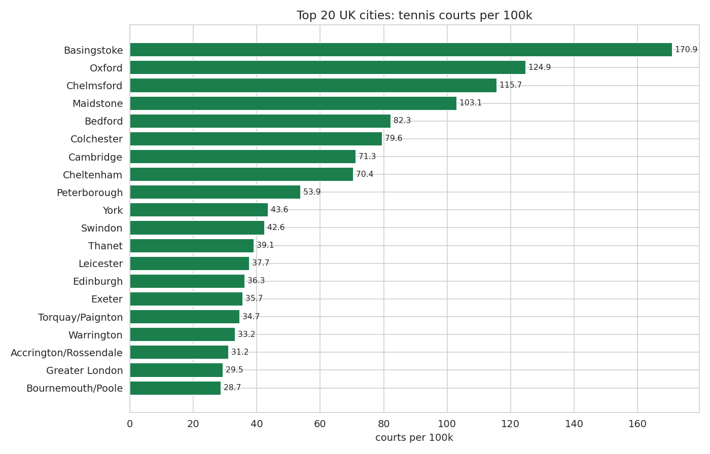
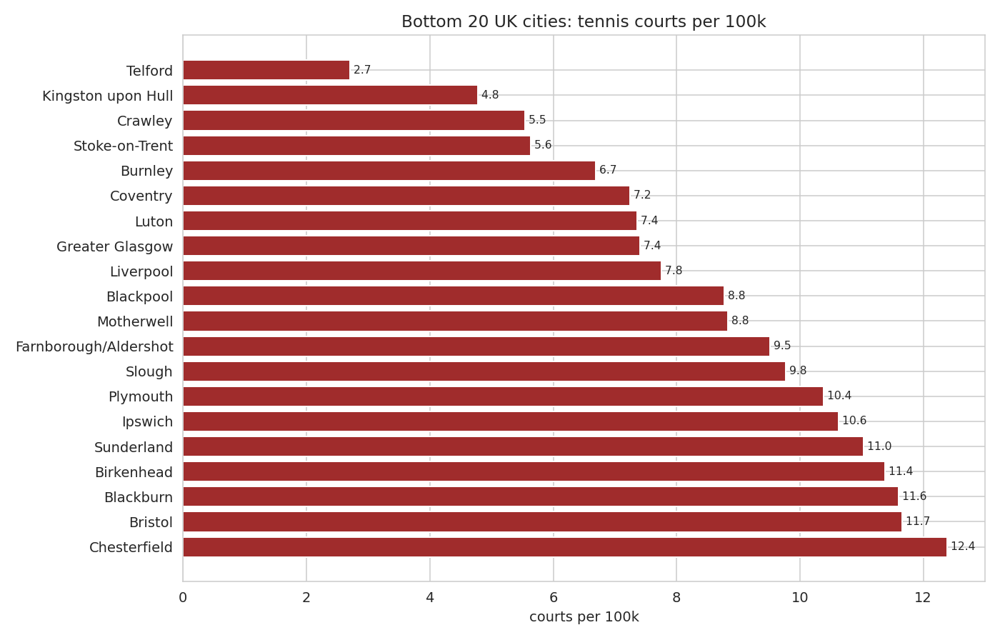
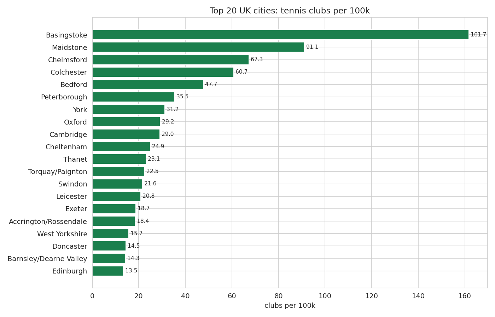
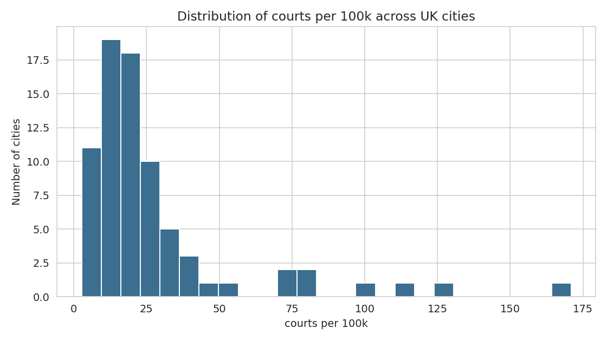
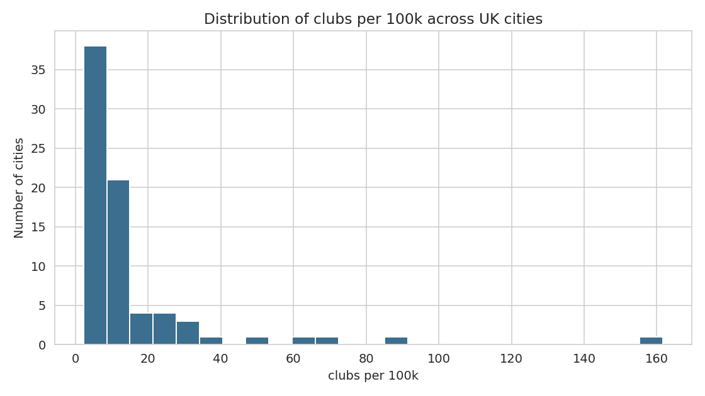
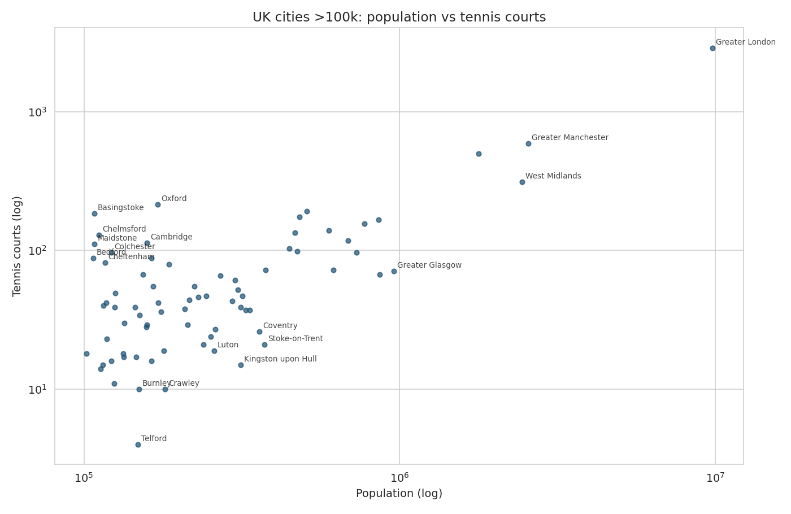
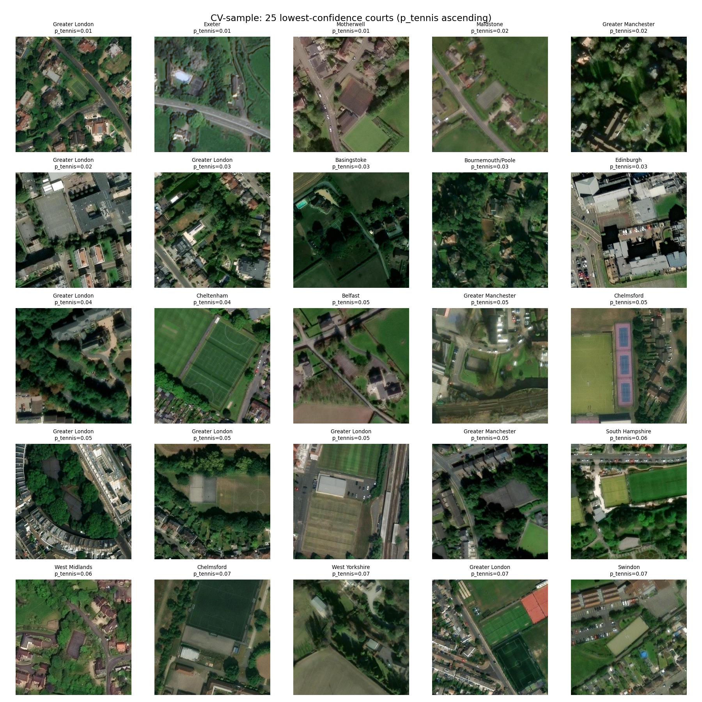
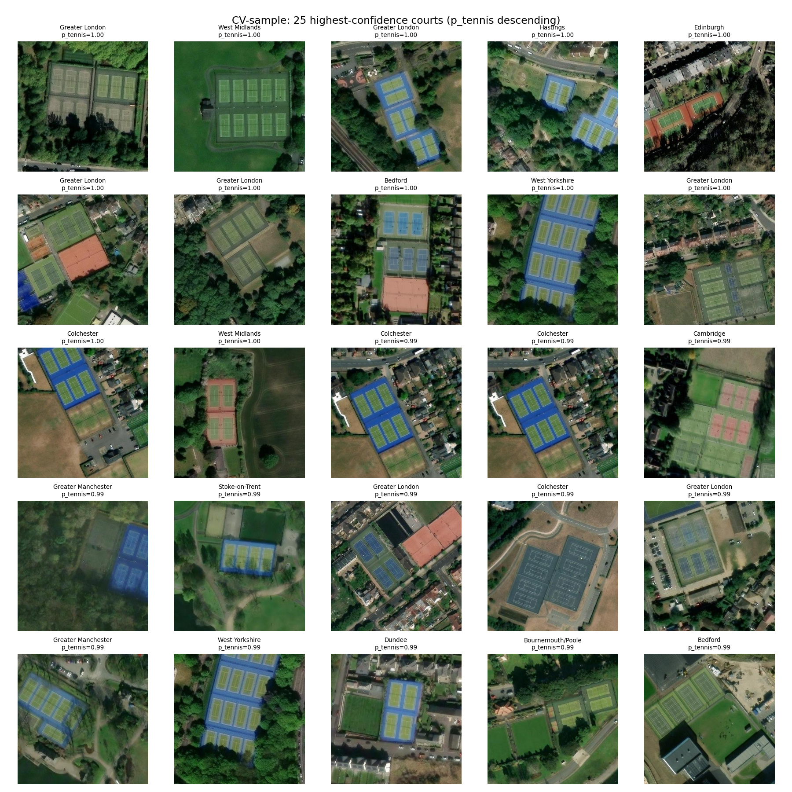

# UK Tennis Courts Per Capita (Phase 1)

Analysis of public/non-private tennis courts and clubs per 100,000 population across UK Built-Up Areas with population ≥ 100,000.

## Methodology summary

- City list: ONS Built-Up Areas (2011 census), 76 areas ≥ 100k.

- Tennis features sourced from OpenStreetMap via Overpass API.

- Elements considered: `leisure=pitch + sport=tennis`, `leisure=sports_centre + sport=tennis`, `club=tennis`.

- Courts clustered into clubs/facilities by 75m proximity (greedy union-find).

- Private (`access=private`) and members-only (`access=members`) facilities are reported separately and EXCLUDED from primary stats. Untagged access defaults to inclusion (typical for park courts).

- Full methodology in `APPROACH.md`.

## Headline numbers

- Cities analysed: **76**

- Combined population: **36,425,782**

- Non-private courts: **8,662**

- Non-private clubs/facilities: **3,914**

- Median courts/100k: **19.37**

- Median clubs/100k: **8.66**

- Excluded private courts (separate stat): **1,238**

- Members-only courts (separate stat): **2**

## Top 20 cities by courts per 100k

| Rank | City | Population | Courts | Clubs | Courts/100k | Clubs/100k |
| --- | --- | --- | --- | --- | --- | --- |
| 73 | Basingstoke | 107,642 | 184 | 174 | 170.94 | 161.65 |
| 45 | Oxford | 171,380 | 214 | 50 | 124.87 | 29.17 |
| 72 | Chelmsford | 111,511 | 129 | 75 | 115.68 | 67.26 |
| 74 | Maidstone | 107,627 | 111 | 98 | 103.13 | 91.06 |
| 75 | Bedford | 106,940 | 88 | 51 | 82.29 | 47.69 |
| 65 | Colchester | 121,859 | 97 | 74 | 79.60 | 60.73 |
| 49 | Cambridge | 158,434 | 113 | 46 | 71.32 | 29.03 |
| 68 | Cheltenham | 116,447 | 82 | 29 | 70.42 | 24.90 |
| 48 | Peterborough | 163,379 | 88 | 58 | 53.86 | 35.50 |
| 52 | York | 153,717 | 67 | 48 | 43.59 | 31.23 |
| 40 | Swindon | 185,609 | 79 | 40 | 42.56 | 21.55 |
| 61 | Thanet | 125,370 | 49 | 29 | 39.08 | 23.13 |
| 13 | Leicester | 508,916 | 192 | 106 | 37.73 | 20.83 |
| 14 | Edinburgh | 482,270 | 175 | 65 | 36.29 | 13.48 |
| 67 | Exeter | 117,763 | 42 | 22 | 35.66 | 18.68 |
| 69 | Torquay/Paignton | 115,410 | 40 | 26 | 34.66 | 22.53 |
| 46 | Warrington | 165,456 | 55 | 20 | 33.24 | 12.09 |
| 62 | Accrington/Rossendale | 125,059 | 39 | 23 | 31.19 | 18.39 |
| 1 | Greater London | 9,787,426 | 2,883 | 967 | 29.46 | 9.88 |
| 16 | Bournemouth/Poole | 466,266 | 134 | 49 | 28.74 | 10.51 |

## Bottom 20 cities by courts per 100k

| Rank | City | Population | Courts | Clubs | Courts/100k | Clubs/100k |
| --- | --- | --- | --- | --- | --- | --- |
| 55 | Telford | 147,980 | 4 | 4 | 2.70 | 2.70 |
| 24 | Kingston upon Hull | 314,018 | 15 | 7 | 4.78 | 2.23 |
| 41 | Crawley | 180,508 | 10 | 10 | 5.54 | 5.54 |
| 19 | Stoke-on-Trent | 372,775 | 21 | 17 | 5.63 | 4.56 |
| 54 | Burnley | 149,422 | 10 | 7 | 6.69 | 4.68 |
| 20 | Coventry | 359,262 | 26 | 14 | 7.24 | 3.90 |
| 31 | Luton | 258,018 | 19 | 12 | 7.36 | 4.65 |
| 5 | Greater Glasgow | 957,620 | 71 | 30 | 7.41 | 3.13 |
| 6 | Liverpool | 864,122 | 67 | 30 | 7.75 | 3.47 |
| 34 | Blackpool | 239,409 | 21 | 7 | 8.77 | 2.92 |
| 63 | Motherwell | 124,540 | 11 | 8 | 8.83 | 6.42 |
| 32 | Farnborough/Aldershot | 252,397 | 24 | 9 | 9.51 | 3.57 |
| 47 | Slough | 163,777 | 16 | 14 | 9.77 | 8.55 |
| 30 | Plymouth | 260,203 | 27 | 18 | 10.38 | 6.92 |
| 42 | Ipswich | 178,835 | 19 | 10 | 10.62 | 5.59 |
| 21 | Sunderland | 335,415 | 37 | 21 | 11.03 | 6.26 |
| 22 | Birkenhead | 325,264 | 37 | 14 | 11.38 | 4.30 |
| 56 | Blackburn | 146,521 | 17 | 5 | 11.60 | 3.41 |
| 11 | Bristol | 617,280 | 72 | 37 | 11.66 | 5.99 |
| 71 | Chesterfield | 113,057 | 14 | 7 | 12.38 | 6.19 |

## Top 20 cities by clubs per 100k

| Rank | City | Population | Courts | Clubs | Courts/100k | Clubs/100k |
| --- | --- | --- | --- | --- | --- | --- |
| 73 | Basingstoke | 107,642 | 184 | 174 | 170.94 | 161.65 |
| 74 | Maidstone | 107,627 | 111 | 98 | 103.13 | 91.06 |
| 72 | Chelmsford | 111,511 | 129 | 75 | 115.68 | 67.26 |
| 65 | Colchester | 121,859 | 97 | 74 | 79.60 | 60.73 |
| 75 | Bedford | 106,940 | 88 | 51 | 82.29 | 47.69 |
| 48 | Peterborough | 163,379 | 88 | 58 | 53.86 | 35.50 |
| 52 | York | 153,717 | 67 | 48 | 43.59 | 31.23 |
| 45 | Oxford | 171,380 | 214 | 50 | 124.87 | 29.17 |
| 49 | Cambridge | 158,434 | 113 | 46 | 71.32 | 29.03 |
| 68 | Cheltenham | 116,447 | 82 | 29 | 70.42 | 24.90 |
| 61 | Thanet | 125,370 | 49 | 29 | 39.08 | 23.13 |
| 69 | Torquay/Paignton | 115,410 | 40 | 26 | 34.66 | 22.53 |
| 40 | Swindon | 185,609 | 79 | 40 | 42.56 | 21.55 |
| 13 | Leicester | 508,916 | 192 | 106 | 37.73 | 20.83 |
| 67 | Exeter | 117,763 | 42 | 22 | 35.66 | 18.68 |
| 62 | Accrington/Rossendale | 125,059 | 39 | 23 | 31.19 | 18.39 |
| 4 | West Yorkshire | 1,777,934 | 500 | 279 | 28.12 | 15.69 |
| 50 | Doncaster | 158,141 | 29 | 23 | 18.34 | 14.54 |
| 36 | Barnsley/Dearne Valley | 223,281 | 55 | 32 | 24.63 | 14.33 |
| 14 | Edinburgh | 482,270 | 175 | 65 | 36.29 | 13.48 |

## Distributions

## Computer-vision verification

A random sample of **300** OSM-tagged courts was checked against Esri World Imagery (zoom 18, 2x2-tile stitch centred on the OSM coordinate) using CLIP zero-shot classification. The model was prompted with five tennis-specific descriptions (hard / clay / grass / multi-court / generic) and seven non-tennis variants; a court is marked as verified when the aggregated tennis probability is the dominant class.

- Aggregate tennis probability dominant in **179/300 (59.7%)** of sampled tiles.

- Manual review of the lower-confidence subset (see `reports/uk_cv_lowconf.png`) shows that CLIP base-32 systematically struggles with grass courts, courts at the edge of the cropped tile, and small/old hardcourts that blend with surroundings. The visible-court ratio in that subset is high; the precision figure above therefore *understates* the true OSM tagging precision. The high-confidence subset (`reports/uk_cv_highconf.png`) is essentially all real tennis courts.

- For a stronger ground-truth precision estimate, a CLIP-large or trained classifier should be used; this is queued for a follow-up pass.

## Caveats

- **OSM tagging completeness varies** between cities — well-mapped areas may overstate the gap to sparsely-mapped ones. CV verification (see Phase 1.5) calibrates this.

- **Court-count inference**: each OSM `leisure=pitch` is treated as one court unless `tennis:courts=N` is set. Multi-court parks tagged as a single pitch will undercount; subsequent satellite verification will correct.

- **Conurbation boundaries**: built-up areas without clean OSM relations (e.g. Tyneside, Teesside) used composite or fallback queries; documented in `data/raw/uk_cities_raw.tsv` and resolver output.

- **Admin boundary != BUA**: a few cities (Basingstoke, Maidstone, Chelmsford, Motherwell) use the surrounding council/borough relation as a polygon proxy. This includes village courts beyond the BUA edge while the population denominator is the BUA population, so per-100k figures for these cities are upward-biased relative to BUA-only counts. Belfast uses a hand-drawn bbox and may include or exclude a few peripheral facilities.

- **Population data is 2011 census** — ONS has not yet republished the 2021 equivalent built-up area dataset (as of mid-2025).
